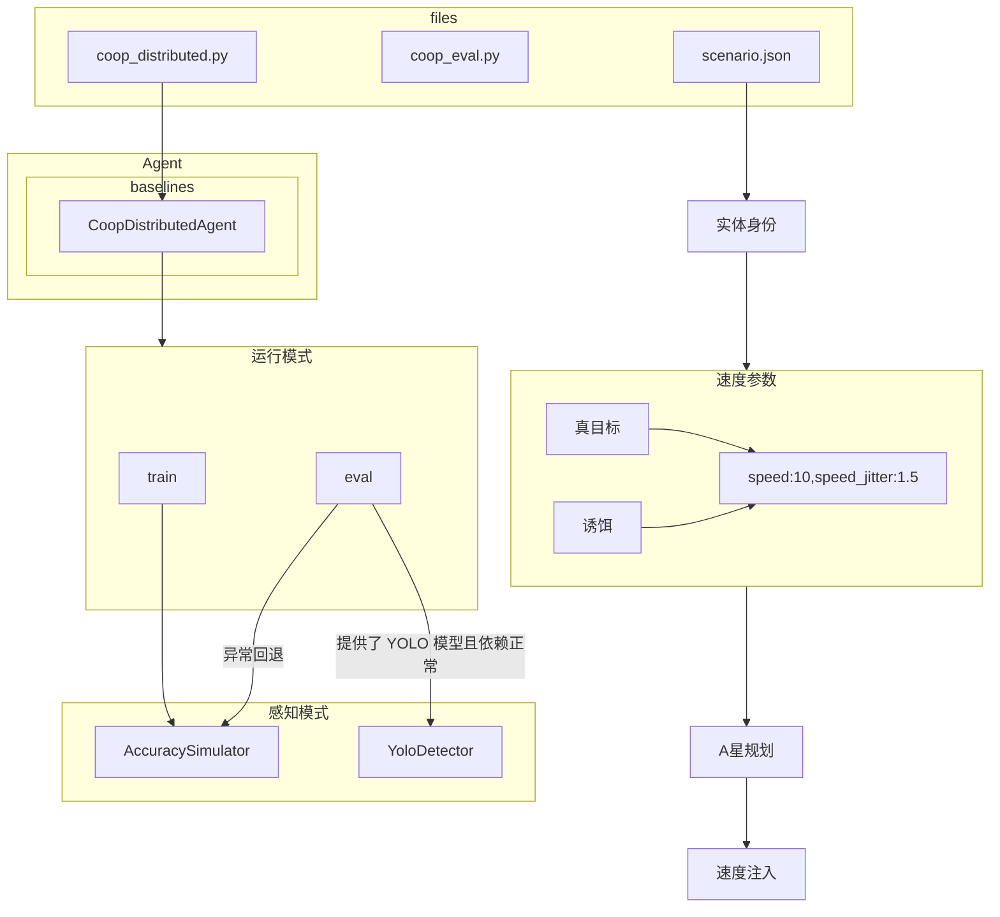

官方基线自己区分真目标和诱饵的规则：
- 至少观察约 3 秒，估算速度达到 3.0 m/s：确认真目标；
- 至少观察约 5 秒，估算速度低于 2.5 m/s：确认诱饵；
- 验证超过 8 秒仍不能确认：放弃该目标。

赛题启动代码明确为真目标和诱饵都分配并注入 A* 运动路线：
[runner.py (line 172)](../../../competition/sdk/scenarios/coop_decoy/runner.py:172)。但是这步规划和注入有可能失败(A* 超时)，如果失败，则对应无人车会静止。