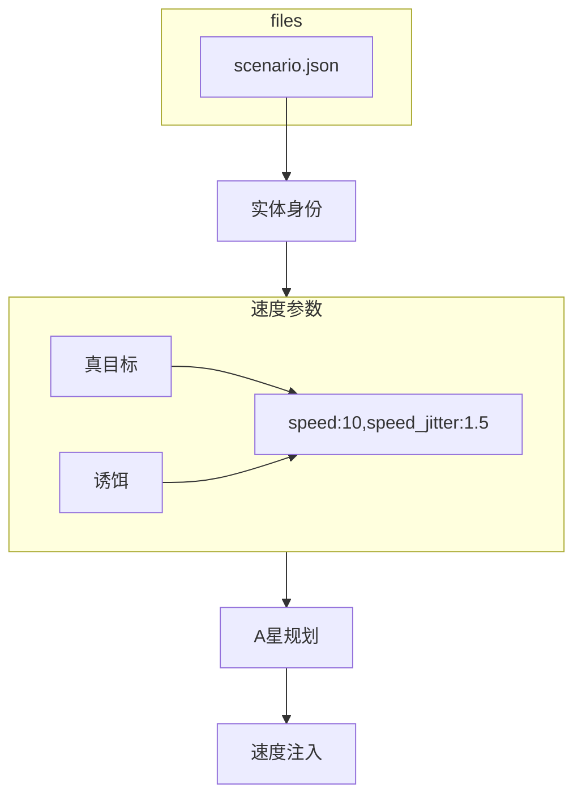

## 参赛手册对于真目标和诱饵的界定

参赛手册`红枫2026无人集群自主协同智能算法挑战赛参赛手册.docx`有三处相互印证：
- 总体规则：真目标和诱饵都可以机动，需要依靠视觉特征判断。
- 赛题二：3 台移动真目标、15 台移动诱饵。
- SDK 感知约束：target_type 不可靠，真目标和诱饵都是移动的。

## 代码的实现历史

| 版本时间 | 真目标配置 | 诱饵配置 | 基线假设 |
|---|---:|---:|---|
| 2026-07-17 初始版本 | 5、9、12 m/s | 0 m/s | 5–12 与 0，完全匹配 |
| 2026-07-27 | 5、9、12 m/s | 0 m/s | 仍然匹配 |
| 2026-08-29 起 | 全部 10，增加 jitter 1.5 | 全部 10，增加 jitter 1.5 | 未更新 |
| v2.0.3 / v2.0.4 | 全部 10 | 全部 10 | 仍保留旧假设 |

## 设定流程

官方基线自己区分真目标和诱饵的规则：
- 至少观察约 3 秒，估算速度达到 3.0 m/s：确认真目标；
- 至少观察约 5 秒，估算速度低于 2.5 m/s：确认诱饵；
- 验证超过 8 秒仍不能确认：放弃该目标。
这个速度判断逻辑是根据经纬度变化情况估计的，并不是违规获取上帝信息。
但是实际的真目标和假目标的速度部分是不确定的，大概率得靠视觉来区分。

赛题启动代码明确为真目标和诱饵都分配并注入 A* 运动路线：
[runner.py (line 172)](../../../competition/sdk/scenarios/coop_decoy/runner.py:172)。但是这步规划和注入有可能失败(A* 超时)，如果失败，则对应无人车会静止。

